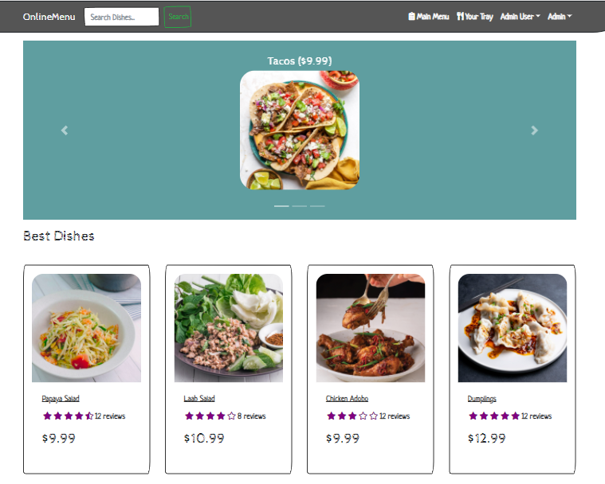

## This application is a dinamic menu built with the MERN stack & Redux.

## Live Link

- To view this App:https://onlinemenuapp1.herokuapp.com/
- My Portfolio:https://mguaraz120.github.io/Portfolio/
- My Linkedin Page:https://www.linkedin.com/in/mario-vizcaino-187ab9104/

## Features

- Full featured cart funcionality
- Dish reviews and ratings
- Top dishes carousel
- Dishes pagination
- Dishes search feature
- User profile with orders
- Admin dishes management
- Admin user management
- Admin Order details page
- Mark orders as delivered option
- Checkout process like payment method, etc.
- PayPal / credit card integration

## Technologies Used

- React
- Redux
- Mongo
- Mongoose
- Node
- Express
- CSS
- Javascript

## Libraries Used

### Frontend

- axios
- react
- react-bootstrap
- react-dom
- react-helmet
- react-paypal-button-v2
- react-redux
- react-router-bootstrap
- react-router-dom
- react-scripts
- redux
- redux-devtools-extension
- redux-thunk

### Backend

- bcryptjs
- dotenv
- express
- express-async-handler
- jsonwebtoken
- mongoose
- morgan
- multer

  
